# Employee Arrival Greetings

[](images/n8n_unifi.png)

[](https://n8n.io)
[](https://www.postgresql.org/)
[](https://anthropic.com)
[](https://ui.com)
[](https://twilio.com)
[](LICENSE)
[]()
[]()

> ### *"People will forget what you said, people will forget what you did, but people will never forget how you made them feel."* — Maya Angelou

---

## What This Project Does

The **Employee Arrival Greetings** system is an automated employee engagement solution that detects when team members arrive at the office via WiFi presence and sends them personalized, AI-generated greeting messages via SMS. It creates a warm, welcoming atmosphere by ensuring every employee feels valued and appreciated the moment they walk through the door.

The system leverages **UniFi Network API** to detect when employee devices connect to the office WiFi, **Claude AI (Anthropic)** to generate unique, heartfelt greetings that never repeat, and **Twilio** to deliver messages via SMS. All data flows through **PostgreSQL** for tracking greeting history, presence detection, and first arrival times.

The entire system runs as an n8n workflow with PostgreSQL storage, designed for hands-off operation. A scheduled trigger runs every 5 minutes to detect new arrivals and process greetings, with intelligent deduplication ensuring each employee receives exactly one greeting per day. The workflow implements greeting memory to avoid repetition, time-aware messaging (morning/afternoon/evening), day-aware context (Monday energy, Friday vibes), and batch processing to handle multiple simultaneous arrivals.

> **New to n8n?** Check out my [n8n_nginx](https://github.com/rjsears/n8n_nginx) repository for a complete n8n + PostgreSQL + Nginx setup with SSL. You can have a production-ready n8n instance running in about 20 minutes!

---

[](images/unifi_employee_screenshot.png)

---

## Table of Contents

- [Features](#-features)
- [System Architecture](#-system-architecture)
- [Workflow Diagram](#-workflow-diagram)
- [Requirements](#-requirements)
- [Quick Start](#-quick-start)
- [Database Setup](#-database-setup)
- [Workflow Configuration](#-workflow-configuration)
- [Finding Your UniFi Credentials](#-finding-your-unifi-credentials)
- [Employee Setup](#-employee-setup)
- [Customization](#-customization)
- [Useful Commands](#-useful-commands)
- [Troubleshooting](#-troubleshooting)
- [License](#-license)
- [Special Thanks](#-special-thanks)

---

## ✨ Features

### WiFi Presence Detection

- **UniFi API Integration** — Connects to UniFi Network Controller to monitor connected devices in real-time
- **MAC Address Matching** — Associates employee devices with their contact records using WiFi MAC addresses
- **Automatic Detection** — Checks for new arrivals every 5 minutes (configurable interval)
- **First Arrival Tracking** — Records when employees actually first arrive each day, not just WiFi reconnections

### AI-Powered Greetings

- **Claude Sonnet AI** — Generates warm, unique greetings using Anthropic's Claude with high creativity settings
- **Greeting Memory** — Stores last 10 greetings per employee and includes them in AI prompt to prevent repetition
- **High Temperature** — Uses temperature 0.9 for varied, natural-sounding messages
- **Anti-Corporate Policy** — Prompts specifically avoid corporate jargon, toxic positivity, and cheesy phrases

### Smart Message Generation

- **Time-Aware** — Automatically uses "Good morning/afternoon/evening" based on arrival time
- **Day-Aware** — References Monday fresh starts, Friday celebrations, and mid-week momentum
- **Character Limited** — Stays under 155 characters for SMS compatibility
- **Emoji Support** — Includes one tasteful emoji at the end for personality

### Operational Excellence

- **Scheduled Automation** — Runs automatically every 5 minutes with zero intervention
- **Multi-Employee Processing** — Uses loop batching to handle multiple simultaneous arrivals
- **Daily Reset** — Greeting tracking resets automatically at midnight each day
- **Timezone Support** — Fully configurable timezone (default: America/Los_Angeles)
- **Graceful Handling** — Empty batches and edge cases handled without workflow failures

---

## 🏗 System Architecture

The workflow integrates multiple services to create a seamless employee greeting experience:

```mermaid
flowchart LR
    subgraph NETWORK["Network Layer"]
        UNIFI[("UniFi<br/>Controller")]
    end
    
    subgraph WORKFLOW["n8n Workflow Engine"]
        N8N["Employee Arrival<br/>Greetings Workflow"]
    end
    
    subgraph DATA["Data Layer"]
        PG[("PostgreSQL<br/>Database")]
    end
    
    subgraph AI["AI Layer"]
        CLAUDE["Claude<br/>Sonnet AI"]
    end
    
    subgraph DELIVERY["Delivery Layer"]
        TWILIO["Twilio<br/>SMS API"]
        PHONE["📱 Employee<br/>Phone"]
    end
    
    UNIFI -->|"WiFi Clients"| N8N
    PG <-->|"Contacts &<br/>History"| N8N
    N8N -->|"Generate<br/>Greeting"| CLAUDE
    CLAUDE -->|"Unique<br/>Message"| N8N
    N8N -->|"Send SMS"| TWILIO
    TWILIO -->|"Deliver"| PHONE
```



### Component Overview

| Component | Purpose | Key Function |
|-----------|---------|--------------|
| **UniFi Controller** | Network monitoring | Provides real-time WiFi client data via REST API |
| **n8n Workflow** | Orchestration | Coordinates detection, AI generation, and delivery |
| **PostgreSQL** | Data storage | Stores contacts, greeting history, and presence data |
| **Claude AI** | Content generation | Creates unique, personalized greeting messages |
| **Twilio** | Message delivery | Sends SMS messages to employee phones |

---

## 📊 Workflow Diagram

The workflow follows a structured path from detection through delivery:


### Node Details

| Node | Type | Purpose |
|------|------|---------|
| **Every 5 Minutes** | Schedule Trigger | Initiates workflow on configurable interval |
| **Get WiFi Clients** | HTTP Request | Fetches all connected devices from UniFi API |
| **Get Employees with MACs** | PostgreSQL | Queries employees with registered MAC addresses |
| **Find New Arrivals** | Code | JavaScript logic to match MACs and filter ungreeted |
| **Has Arrivals?** | IF | Conditional check to prevent empty processing |
| **Loop Over Arrivals** | Split In Batches | Processes each employee individually |
| **Get Recent Greetings** | PostgreSQL | Fetches last 10 greetings for repetition avoidance |
| **Prepare Context** | Code | Merges employee data with greeting history |
| **Generate Greeting** | LLM Chain | Sends prompt to Claude for message generation |
| **Anthropic Chat Model** | AI Model | Claude Sonnet 4 with temperature 0.9 |
| **Send Greeting SMS** | Twilio | Delivers message via SMS |
| **Save Greeting History** | PostgreSQL | Stores message for future reference |
| **Mark as Greeted** | PostgreSQL | Updates presence tracking with first_seen_today |

---

## 📋 Requirements

| Requirement | Version | Notes |
|-------------|---------|-------|
| **n8n** | 1.0+ | Self-hosted or cloud |
| **PostgreSQL** | 12+ | For contacts and history storage |
| **UniFi Controller** | Any | UDM Pro, Cloud Key, or self-hosted controller |
| **Anthropic API Key** | — | Required for Claude AI generation |
| **Twilio Account** | — | Required for SMS delivery |

### Obtaining API Keys

#### Anthropic API Key (Required)

1. Create an Anthropic account at [console.anthropic.com](https://console.anthropic.com)
2. Add billing information
3. Generate an API key from the dashboard
4. Copy the key immediately—it won't be shown again!

#### UniFi API Key

1. Log into your UniFi controller
2. Navigate to **Settings** → **Admins & Users**
3. Create a new admin with **Limited Admin** role
4. Generate an API key for that admin

#### Twilio Credentials

1. Create a Twilio account at [twilio.com](https://www.twilio.com)
2. Get a phone number with SMS capability
3. Note your Account SID and Auth Token from the dashboard

---

## 🚀 Quick Start

### Step 1: Deploy n8n Infrastructure

The fastest way to get running is using my [n8n_nginx](https://github.com/rjsears/n8n_nginx) repository:

```bash
# Clone the n8n_nginx repository
git clone https://github.com/rjsears/n8n_nginx
cd n8n_nginx

# Copy and configure the environment file
cp .env.example .env
nano .env  # Edit with your domain, email, and passwords

# Start the stack
docker-compose up -d
```

### Step 2: Set Up the Database

```bash
# Create the database (or use existing)
docker exec -it n8n_postgres psql -U n8n -c "CREATE DATABASE your_database;"

# Run the schema script
docker exec -i n8n_postgres psql -U n8n -d your_database < employee-arrival-greetings-schema.sql
```

### Step 3: Import the Workflow

1. Open n8n at `https://your-domain.com`
2. Go to **Workflows** → **Import from File**
3. Select `employee-arrival-greetings-template.json`
4. Click **Save**

### Step 4: Configure Placeholders

Update these values in the workflow:

| Node | Placeholder | Replace With                              |
|------|-------------|-------------------------------------------|
| Get WiFi Clients | `YOUR_UNIFI_CONTROLLER_IP` | Your UniFi IP (e.g., `10.200.10.5`)       |
| Get WiFi Clients | `YOUR_SITE_ID` | Your UniFi site UUID                      |
| Get WiFi Clients | `YOUR_UNIFI_API_KEY` | Your UniFi API key                        |
| Send Greeting SMS | `YOUR_TWILIO_PHONE_NUMBER` | Your Twilio number (e.g., `+1xxxxxxxxxx`) |
| Generate Greeting | `YOUR_COMPANY_NAME` | Your company name                         |

### Step 5: Set Credentials in n8n

Go to **Settings** → **Credentials** and create:

- **PostgreSQL** credential for all Postgres nodes
- **Anthropic** credential for the Anthropic Chat Model
- **Twilio** credential for the Send Greeting SMS node

### Step 6: Enable and Test

1. Click on **Get Recent Greetings** node → Settings tab → Enable **"Always Output Data"**
2. Toggle the workflow to **Active**
3. Wait for an employee to connect to WiFi, or reset a test employee

---

## 🗄 Database Setup

### Required Tables

Run the included `employee-arrival-greetings-schema.sql` or create tables manually:

#### contacts

The main contacts table with employee flags:

```sql
CREATE TABLE IF NOT EXISTS contacts (
    contact_id SERIAL PRIMARY KEY,
    phone VARCHAR(20) UNIQUE NOT NULL,
    first_name VARCHAR(100),
    last_name VARCHAR(100),
    email VARCHAR(255),
    company_name VARCHAR(255),
    notes TEXT,
    is_employee BOOLEAN DEFAULT FALSE,
    employee_mac VARCHAR(17),  -- Format: xx:xx:xx:xx:xx:xx
    created_at TIMESTAMP WITH TIME ZONE DEFAULT NOW(),
    updated_at TIMESTAMP WITH TIME ZONE DEFAULT NOW()
);

CREATE INDEX IF NOT EXISTS idx_contacts_employee 
ON contacts(is_employee) WHERE is_employee = TRUE;

CREATE INDEX IF NOT EXISTS idx_contacts_mac 
ON contacts(employee_mac) WHERE employee_mac IS NOT NULL;
```

#### presence_greetings

Tracks daily greeting status and first arrival time:

```sql
CREATE TABLE IF NOT EXISTS presence_greetings (
    contact_id INTEGER PRIMARY KEY REFERENCES contacts(contact_id) ON DELETE CASCADE,
    last_greeted DATE,
    last_seen_at TIMESTAMP WITH TIME ZONE,
    first_seen_today TIMESTAMP WITH TIME ZONE
);

CREATE INDEX IF NOT EXISTS idx_presence_greetings_date 
ON presence_greetings(last_greeted);
```

#### greeting_history

Stores all greetings sent for memory and analytics:

```sql
CREATE TABLE IF NOT EXISTS greeting_history (
    id SERIAL PRIMARY KEY,
    contact_id INTEGER REFERENCES contacts(contact_id) ON DELETE CASCADE,
    greeting_text TEXT,
    sent_at TIMESTAMP WITH TIME ZONE DEFAULT NOW()
);

CREATE INDEX IF NOT EXISTS idx_greeting_history_contact 
ON greeting_history(contact_id, sent_at DESC);
```

---

## ⚙️ Workflow Configuration

### Timezone Configuration

The workflow defaults to `America/Los_Angeles` (Pacific Time). To change:

1. Open the **Find New Arrivals** code node
2. Locate `timeZone: 'America/Los_Angeles'`
3. Change to your timezone (e.g., `'America/New_York'`, `'Europe/London'`)

### Schedule Frequency

To change the check interval:

1. Open the **Every 5 Minutes** trigger node
2. Adjust the **Minutes Interval** value
3. Recommended: 3-10 minutes depending on your needs

### AI Model Settings

The Anthropic Chat Model is configured with:

| Setting | Value | Purpose |
|---------|-------|---------|
| Model | `claude-sonnet-4-20250514` | Latest Sonnet for quality + speed |
| Temperature | `0.9` | High creativity for varied messages |
| Max Tokens | `100` | Keeps responses concise |

---

## 🔍 Finding Your UniFi Credentials

### Site ID

**Via UniFi Console:**
1. Log into your UniFi controller
2. The Site ID appears in the URL: `https://controller/network/site/{SITE_ID}/...`

**Via API:**
```bash
curl -sk -H "X-API-KEY: your_api_key" \
  "https://your_controller/proxy/network/integration/v1/sites" | python3 -m json.tool
```

### API Key

1. Log into UniFi controller
2. Go to **Settings** → **Admins & Users**
3. Create or select an admin user
4. Click **API Keys** → **Generate New Key**
5. Copy and save the key immediately

### Test Your Connection

```bash
curl -sk -H "X-API-KEY: your_api_key" \
  "https://your_controller/proxy/network/integration/v1/sites/your_site_id/clients?limit=10"
```

---

## 👥 Employee Setup

### Adding Employees

```sql
-- Add a new employee with MAC address
INSERT INTO contacts (phone, first_name, last_name, email, company_name, is_employee, employee_mac)
VALUES ('7605551234', 'Jane', 'Smith', 'jane@company.com', 'Your Company', TRUE, 'aa:bb:cc:dd:ee:ff');

-- Update existing contact to employee
UPDATE contacts 
SET is_employee = TRUE, employee_mac = 'aa:bb:cc:dd:ee:ff'
WHERE phone = '7605551234';
```

### Finding MAC Addresses

**In UniFi Controller:**
1. Go to **Clients** tab
2. Find the employee's device
3. Click to view details → MAC address shown

**On Employee Devices:**

| Device | Location |
|--------|----------|
| **iPhone** | Settings → General → About → WiFi Address |
| **Android** | Settings → About Phone → Status → WiFi MAC |
| **Windows** | Run `ipconfig /all` → Physical Address |
| **Mac** | System Preferences → Network → Advanced → Hardware |

### MAC Address Format

Always use **lowercase with colons**: `aa:bb:cc:dd:ee:ff`

---

## 🎨 Customization

### Greeting Tone

Edit the prompt in the **Generate Greeting** node. Key sections to customize:

```
**Our Philosophy:**
Our employees are family. They chose to be here, and we are grateful 
every single day for their dedication, talent, and heart.

**What We Want {{ $json.first_name }} to Feel:**
- Appreciated and seen as an individual
- Glad they work here
- Energized and uplifted to start their day
- Like they matter and their presence makes a difference

**Tone:**
- Warm and genuine (like a heartfelt note from someone who cares)
- Uplifting and positive (brighten their day)
- Personal and human (not corporate or robotic)
- Motivational without being preachy
```

### Example Greetings

The AI generates messages like:

- *"Good morning, Sarah! Your energy lights up this place. So glad you're here today! ☀️"*
- *"Good afternoon, Mike! We're lucky to have you on the team. Thanks for all you do! 🙌"*
- *"Good morning, Jessica! Happy Friday - you've earned it. Enjoy the finish line! 🎉"*
- *"Good morning, Tom! New week, fresh start, and you're already making it better! 💪"*

---

## 🛠 Useful Commands

### View Employee Greeting Status

```bash
docker exec n8n_postgres psql -U n8n -d your_database -c "
SELECT
  c.contact_id,
  c.first_name,
  c.last_name,
  c.employee_mac,
  pg.last_greeted,
  pg.first_seen_today AT TIME ZONE 'America/Los_Angeles' AS first_arrival,
  CASE WHEN pg.last_greeted = CURRENT_DATE THEN 'YES' ELSE 'NO' END AS greeted_today
FROM contacts c
LEFT JOIN presence_greetings pg ON c.contact_id = pg.contact_id
WHERE c.is_employee = TRUE
ORDER BY c.first_name;
"
```

### View Today's Greetings

```bash
docker exec n8n_postgres psql -U n8n -d your_database -c "
SELECT 
  c.first_name,
  c.last_name,
  gh.greeting_text,
  gh.sent_at AT TIME ZONE 'America/Los_Angeles' AS sent_at
FROM greeting_history gh
JOIN contacts c ON gh.contact_id = c.contact_id
WHERE gh.sent_at::DATE = CURRENT_DATE
ORDER BY gh.sent_at DESC;
"
```

### Reset Employee for Testing

```bash
# Reset specific employee (replace contact_id)
docker exec n8n_postgres psql -U n8n -d your_database -c \
  "DELETE FROM presence_greetings WHERE contact_id = 30;"

# Reset all employees
docker exec n8n_postgres psql -U n8n -d your_database -c \
  "TRUNCATE presence_greetings;"
```

### View Greeting History

```bash
docker exec n8n_postgres psql -U n8n -d your_database -c "
SELECT greeting_text, sent_at AT TIME ZONE 'America/Los_Angeles'
FROM greeting_history
WHERE contact_id = 30
ORDER BY sent_at DESC
LIMIT 10;
"
```

### Database Backup

```bash
docker exec n8n_postgres pg_dump -U n8n your_database > backup_$(date +%Y%m%d).sql
```

---

## 🔧 Troubleshooting

### Greetings Not Sending

| Issue | Solution |
|-------|----------|
| MAC address not matching | Ensure lowercase with colons: `aa:bb:cc:dd:ee:ff` |
| Employee not found | Verify `is_employee = TRUE` and `employee_mac` is set |
| Already greeted today | Check `presence_greetings` table, delete record to reset |
| Device not on WiFi | Confirm device is connected to monitored network |
| Wrong site ID | Verify site UUID in UniFi API call |

### Only First Person Gets Greeted

| Issue | Solution |
|-------|----------|
| Missing loop node | Ensure **Loop Over Arrivals** (Split In Batches) exists |
| Wrong connections | Verify **Mark as Greeted** loops back to batch node |
| Batch size wrong | Set batch size to `1` in Loop Over Arrivals |

### AI Not Generating Messages

| Issue | Solution |
|-------|----------|
| Empty response | Check Anthropic API key and available credits |
| Timeout errors | Reduce prompt length or increase node timeout |
| Repeated messages | Verify greeting_history table is storing correctly |

### Wrong Arrival Times

| Issue | Solution |
|-------|----------|
| Shows greeting time | Ensure using `first_seen_today` from database |
| Times reset during day | WiFi reconnection issue; database tracking handles this |
| Wrong timezone | Update timezone in Find New Arrivals code node |

---

## 📄 License

This project is licensed under the MIT License. See [LICENSE](LICENSE) for details.

---

## Acknowledgments

- [n8n](https://n8n.io) — Workflow automation platform
- [Anthropic](https://anthropic.com) — Claude AI for greeting generation
- [Ubiquiti](https://ui.com) — UniFi network infrastructure
- [Twilio](https://twilio.com) — SMS delivery platform
- [PostgreSQL](https://www.postgresql.org/) — Database engine

---

## Support

- **Issues:** [GitHub Issues](https://github.com/rjsears/employee_arrival_greetings/issues)
- **Discussions:** [GitHub Discussions](https://github.com/rjsears/employee_arrival_greetings/discussions)

---

## Special Thanks

- **My amazing and loving family!** My family puts up with all my coding and automation projects and encourages me in everything. Without them, my projects would not be possible.
- **My brother James**, who is a continual source of inspiration to me and others. Everyone should have a brother as awesome as mine!


